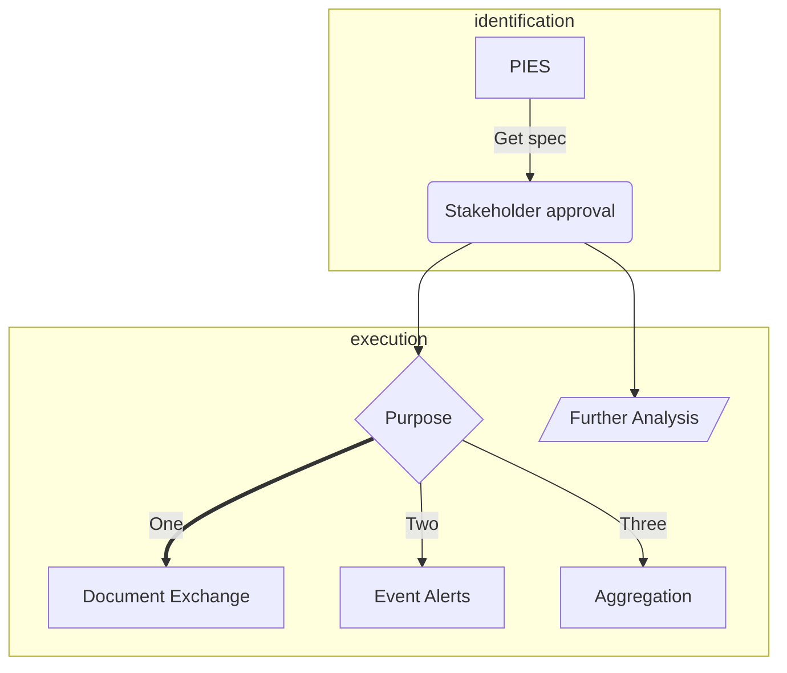

## Graph Examples

### State Machine

```mermaid
graph TD
  A-->B
  A-->C
  B-->D
  C-->D
```

### Flowchart

```mermaid
graph TD
  A[PIES] -->|Get spec| B(Stakeholder approval)
  B --> C{Purpose}
  B --> G[/Further Analysis/]
  C ==>|One| D[Document Exchange]
  C -->|Two| E[Event Alerts]
  C -->|Three| F[Aggregation]
  subgraph identification
    A
    B
  end
  subgraph execution
    C
    D
    E
    F
    G
  end
```
